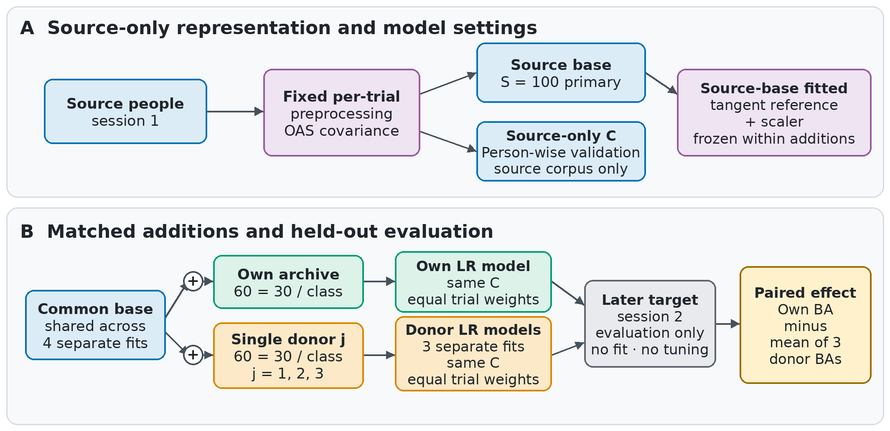

# Personal history versus matched external data in motor-imagery decoding



**Question.** How much does a person's earlier-session EEG archive add beyond an equal amount of data from other people, and does
that advantage last when the shared source database grows?

**Design (Figure 1).**
- A common source base is fitted once: covariance, tangent space and a logistic regression.
- The base then receives either 60 trials from the target person's first session, or 60 trials from each of three random
  external donors. Everything else stays fixed: the base, the representation and the classifier settings.
- Evaluation uses only the person's later session, with no fitting or tuning on it.
- The paired effect is the balanced accuracy with the person's own data minus the mean over the three donors.

**Results** (from the frozen result files):
- **Small source base (100 trials):** the mean advantage of personal archives was 3.8, 8.5 and 4.6 percentage points in three
  cross-day motor-imagery datasets.
- **Separately held 24-person cohort:** a 3.0-point advantage (primary 95% Student-t interval 1.1 to 4.9), at 61.9% versus
  58.8% absolute accuracy.
- **Larger common bases (1,620 and 972 trials):** the external additions were reserved first. Mean advantages were then 2.0
  and 1.4 points in the two development datasets, and 0.9 points in the reused 24-person cohort (95% interval -0.3 to 2.0).
  In that cohort the advantage shrank by 2.1 points (95% interval 0.8 to 3.5).

## Layout
| Path | Contents |
|---|---|
| `src/expose/` | Dataset loaders (MOABB BNCI 2014-001, BNCI 2014-004, Lee 2019 / OpenBMI), baselines, membership and operation construction, validation |
| `scripts/` | Download, preparation, run, analysis, verification and plotting scripts, by study stage |
| `research/` | Frozen study configurations with SHA-256 files, participant roles and the confirmation source packet |
| `tests/` | Unit and contract tests |

## Reproduce
```bash
python -m venv .venv && . .venv/bin/activate
pip install -r requirements.txt
python -m pytest -q            # 372 tests, CPU only, no EEG download needed
```
The full pipeline downloads the public datasets through MOABB. Lee 2019 is GigaScience DB 10.5524/100542, about 25 GB.
The scripts then run in the order their names give (`download_*` → `prepare_*` → `run_*` → `analyze_*` / `plot_*`).
Raw EEG and derived arrays are not in this repository.

## Limitations
- The effect sizes hold for the specified pipeline only: covariance, tangent space and logistic regression, with 60-trial
  additions and three donors.
- At larger source bases the advantage becomes smaller and its interval includes zero in the reused cohort.
- Two tests are deselected in `pytest.ini`, because they check private project-management packets that are not released.

## License
MIT. See `LICENSE`.
